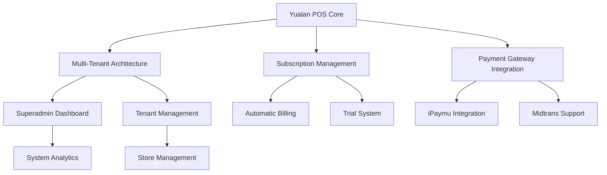

# 🚀 Yualan POS: Solusi Point of Sale Modern & Terbuka untuk Bisnis Anda

<div align="center">
  


**Transformasi Pengalaman Berjualan dengan Platform POS Berbasis Cloud yang Powerful dan Terjangkau**

[](LICENSE)
[](https://php.net/)
[](https://laravel.com/)

</div>

## ✨ Mengapa Memilih Yualan POS?

Yualan POS hadir sebagai **solusi revolusioner** untuk mengelola operasional bisnis ritel Anda. Sebagai platform **SaaS (Software as a Service)** yang sepenuhnya **open source**, kami memberikan kebebasan penuh tanpa biaya lisensi yang membebani.

### 🎯 Dibuat untuk Kesuksesan Bisnis Anda
- **Multi-Tenant Architecture** - Kelola banyak toko dalam satu sistem terpadu
- **Cloud-Based Technology** - Akses data penjualan kapan saja, di mana saja
- **Zero License Cost** - Bebas dari biaya lisensi berkat lisensi GPLv2

## 🌟 Fitur Unggulan

### 🛍️ Manajemen Penjualan Lengkap
- **Checkout Cepat** - Proses transaksi dalam hitungan detik
- **Multi-Metode Pembayaran** - Tunai, QRIS, E-Wallet (iPaymu & Midtrans)
- **Manajemen Produk** - Kelola SKU, kategori, harga, dan stok dengan mudah
- **Customer Management** - Bangun database pelanggan dan loyalitas

### 📊 Manajemen Inventaris Cerdas
- **Real-Time Stock Tracking** - Pantau stok secara live across semua outlet
- **Supplier Management** - Kelola rantai pasokan dengan efisien
- **Stock Adjustment** - Koreksi stok dengan antarmuka intuitif
- **Inventory Reports** - Laporan nilai stok dan pergerakan barang

### 💰 Sistem Berlangganan Modern
- **Flexible Subscription Plans** - Berbagai pilihan paket berlangganan
- **Automatic Billing** - Invoice otomatis dengan integrasi payment gateway
- **Free Trial System** - Masa percobaan untuk tenant baru
- **Subscription Dashboard** - Monitor status langganan secara real-time

### 👥 Multi-Level Access Control
- **Superadmin** - Kontrol penuh atas seluruh sistem dan tenant
- **Admin/Pemilik Toko** - Kelola operasional toko dan laporan keuangan
- **Kasir** - Akses terbatas untuk transaksi harian

## 🏆 Keunggulan Kompetitif

| Fitur | Yualan POS | Competitor A | Competitor B |
|-------|------------|--------------|--------------|
| **Open Source** | ✅ Yes | ❌ No | ❌ No |
| **Multi-Tenant** | ✅ Yes | ❗ Limited | ❌ No |
| **Zero License Fee** | ✅ Yes | ❌ No | ❌ No |
| **Cloud-Based** | ✅ Yes | ✅ Yes | ❌ No |
| **Customizable** | ✅ Full | ❗ Partial | ❌ No |

## 🚀 Mulai dalam 5 Menit

```bash
# Clone the repository
git clone https://github.com/Abdurozzaq/Yualan.git
cd Yualan

# Install dependencies
composer install
npm install

# Setup environment
cp .env.example .env
php artisan key:generate

# Setup database and run migrations
php artisan migrate --seed

# Start development servers
npm run dev        # For frontend assets
php artisan serve  # For backend server
```

📚 **Butuh panduan lebih detail?** Kunjungi [Dokumentasi Instalasi Lengkap](docs/installation.md)

## 🛠️ Teknologi Canggih di Balik Yualan

- **Backend Framework**: Laravel 12.x dengan PHP 8.2+
- **Frontend Stack**: Vue 3, TypeScript, dan Inertia.js
- **Styling**: Tailwind CSS dengan komponen Radix Vue
- **Database Support**: MySQL, PostgreSQL, SQLite
- **Payment Integration**: iPaymu Gateway & Midtrans
- **Build Tools**: Vite untuk development yang ultra-cepat

## 📈 Solusi untuk Segala Jenis Bisnis

### 🏪 Retail & Toko Kelontong
Kelola stok, transaksi, dan pelanggan dengan sistem terintegrasi

### ☕ Café & Restoran
POS yang cepat dan reliable untuk environment yang sibuk

### 🛍️ Fashion Boutique
Management produk dengan variant dan kategori yang kompleks

### 📱 Tech Stores
Integrasi payment gateway untuk transaksi high-volume

## 🌐 Ekosistem Yualan



## 📚 Dokumentasi Komprehensif

Kami menyediakan dokumentasi lengkap untuk setiap aspek pengembangan:

- **[📖 Overview & Architecture](docs/README.md)** - Memahami arsitektur sistem
- **[🚀 Installation Guide](docs/installation.md)** - Panduan instalasi step-by-step  
- **[👨‍💻 Development Guide](docs/development-guide.md)** - Best practices development
- **[🗄️ Database Schema](docs/database-schema.md)** - ERD dan relasi tabel
- **[☁️ Deployment Guide](docs/deployment.md)** - Deployment ke production
- **[⚙️ Server Configuration](docs/server-requirement.md)** - Optimasi server
- **[⏰ Task Scheduler](docs/scheduler.md)** - Automated tasks management
- **[🔧 Troubleshooting](docs/troubleshooting.md)** - Solving common issues
- **[🤝 Contributing](docs/contributing.md)** - Guideline kontribusi

## 🤝 Bergabung dengan Komunitas

Kami percaya dalam kekuatan kolaborasi! Mari bersama-sama membangun solusi POS terbaik:

- 🐛 **Laporkan Bug** - Bantu kami meningkatkan stabilitas
- 💡 **Sarankan Fitur** - Bagikan ide untuk pengembangan
- 📖 **Perbaiki Dokumentasi** - Bantu pemahaman pengguna lain
- 🔧 **Submit Pull Request** - Kontribusi langsung ke codebase

## 📊 Roadmap Pengembangan

- [ ] **Mobile App** - POS di ujung jari Anda
- [ ] **Advanced Analytics** - Predictive analytics untuk bisnis
- [ ] **Multi-Currency Support** - Untuk bisnis internasional
- [ ] **API Marketplace** - Integrasi dengan platform eksternal
- [ ] **Inventory Forecasting** - AI-powered stock prediction

## 📜 Lisensi

Yualan POS didistribusikan di bawah **GNU General Public License v2.0**. Ini berarti Anda bebas untuk:

- ✅ Menggunakan untuk keperluan komersial
- ✅ Memodifikasi source code
- ✅ Mendistribusikan ulang
- ✅ Berkontribusi pada pengembangan

Lihat file [LICENSE](LICENSE) untuk detail lengkap.

---

<div align="center">

## 🚀 Siap Transformasi Bisnis Anda?

**Yualan POS - Lebih dari Sekadar Sistem Kasir, Partner Pertumbuhan Bisnis Anda**

[⭐ Star di GitHub](https://github.com/Abdurozzaq/Yualan) | [📖 Dokumentasi](docs/README.md) | [🐛 Laporkan Issue](https://github.com/Abdurozzaq/Yualan/issues)

**#YukJualan #YualanPOS #OpenSourcePOS #RetailTechnology**

</div>
